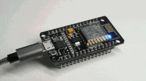

# wifi_deauther_esp8266

A simple WiFi deauther for ESP8266. 

# Working

When the MCU is started, it starts to scan all WiFi AP and deauth all devices connected to it.

# How to start deauth attack
1. Flash the firmware in your ESP8266
2. Start your ESP8266
